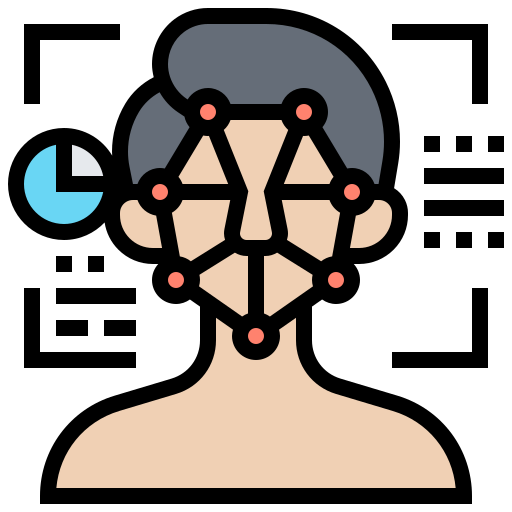

[![Contributors][contributors-shield]][contributors-url]
[![Forks][forks-shield]][forks-url]
[![Stargazers][stars-shield]][stars-url]
[![Issues][issues-shield]][issues-url]
[![MIT License][license-shield]][license-url]
[![LinkedIn][linkedin-shield]][linkedin-url]

<!-- PROJECT LOGO -->
<br />
<p align="center">
    

  <h2 align="center">Real Time Face Anonymizer</h2>

  <p align="center">
    Blur Faces in Real-Time while processing on a single CPU. Make your videos GDPR compliant in minutes.
    <br />
    <a href="https://youtu.be/0TuRVxJVuOI">View Demo</a>
    ·
    <a href="https://github.com/animikhaich/Real-Time-Face-Anonymizer/issues/new">Report Bug</a>
    ·
    <a href="https://github.com/animikhaich/Real-Time-Face-Anonymizer/issues/new">Request Feature</a>
  </p>
</p>
<p align="center">
  
</p>
<!-- TABLE OF CONTENTS -->

## Table of Contents

- [Table of Contents](#table-of-contents)
- [About The Project](#about-the-project)
- [Demo](#demo)
- [Features](#features)
- [Getting Started](#getting-started)
  - [Prerequisites](#prerequisites)
  - [Built With](#built-with)
  - [Minimum Hardware Requirements](#minimum-hardware-requirements)
  - [Installation and Inference](#installation-and-inference)
- [Changelog](#changelog)
- [Roadmap](#roadmap)
- [Contributing](#contributing)
- [License](#license)
- [Contact](#contact)
    - [Animikh Aich](#animikh-aich)

<!-- ABOUT THE PROJECT -->

## About The Project

General Data Protection Regulation (GDPR) is a regulation in EU law on data protection and privacy in the European Union and the European Economic Area.

One of the key guidelines of the GDPR is to hide/remove any personal identification for any person for videos uploaded online or analyzed by Algorithms.

This program aims to provide an option to Anonymize or Blur faces that are visible in a video with the help of a light-weight model that allows real-time processing on limited hardware like CPUs.

This code has been tried and tested on 10th Gen Intel Core i5 10400 CPU and has been observed to provide up-to 59 FPS.

Face Detection Model used: MobileNetV2 based [OpenVINO face-detection-0104 Model](https://docs.openvinotoolkit.org/latest/omz_models_intel_face_detection_0104_description_face_detection_0104.html)

## Demo

-   [YouTube Video](https://youtu.be/0TuRVxJVuOI)

<!-- FEATURES -->

## Features

-   **Automatic Weights Download** - No need to fuss about where to download weights from. It is integrated and is downloaded automatically if not already present.
-   **Extensive Logging** - Find out what happened, how it happened, when it happened
-   **Modular Code** - Feel Free to re-use and modify any part of the code. Each class/Function is created to function as a standalone code.
-   **Single Point of Control** - No need to search in the code where and how to modify a given parameter. Use the single `config.json` to tune parameters as per your specific need.

<!-- GETTING STARTED -->

## Getting Started

At the moment, the GUI Runs but the functional part is broken (since the website has been modified). You can still try out the code, or contribute. Just clone the repository, install the dependencies and start using it.

### Prerequisites

-   [Intel OpenVINO Toolkit](https://docs.openvinotoolkit.org/)
-   [Python 3](https://www.python.org/)
-   [Git](https://git-scm.com/)

### Built With

I wanted to reduce the file-size for this simple project. Hence, I used Tkinter instead of PyQT5.

-   [Intel OpenVINO 2020.3 LTS](https://software.intel.com/content/www/us/en/develop/articles/openvino-2020-3-lts-relnotes.html)
-   [OpenCV](https://opencv.org/)
-   [Numpy](https://numpy.org/)
-   [Requests](https://requests.readthedocs.io/en/master/)

### Minimum Hardware Requirements

-   CPU: 6th Generation Intel Core i3 and Above
-   RAM: 8 GB
-   Storage: 500 MB (Including Dependencies)
-   OS: Ubuntu 16.04 LTS or 18.04 LTS (Tested), Windows

For detailed hardware and software support for OpenVINO please visit the [Computer Vision Hardware Page](https://software.intel.com/content/www/us/en/develop/tools/openvino-toolkit/hardware.html).

### Installation and Inference

1. Install and Set Up Intel OpenVINO by following the [Install Docs](https://docs.openvinotoolkit.org/latest/openvino_docs_install_guides_installing_openvino_linux.html)

2. Clone the repo

```sh
git clone https://github.com/animikhaich/Real-Time-Face-Anonymizer.git
```

3. Install Python packages

```sh
pip install -r requirements.txt
```

4. Change the video source and other settings in the `config.json` file

5. Run the `main.py` file

```sh
python main.py
```

<!-- CHANGELOG -->

## Changelog

See the [Changelog](CHANGELOG.md).

<!-- ROADMAP -->

## Roadmap

See the [open issues](https://github.com/animikhaich/Real-Time-Face-Anonymizer/issues?q=is%3Aopen) for a list of proposed features (and known issues).

<!-- CONTRIBUTING -->

## Contributing

Contributions are what make the open source community such an amazing place to be learn, inspire, and create. Any contributions you make are **greatly appreciated**.

1. Fork the Project
2. Create your Feature Branch (`git checkout -b feature/AmazingFeature`)
3. Commit your Changes (`git commit -m 'Add some AmazingFeature'`)
4. Push to the Branch (`git push origin feature/AmazingFeature`)
5. Open a Pull Request

<!-- LICENSE -->

## License

Distributed under the MIT License. See [LICENSE](LICENSE.md) for more information.

<!-- CONTACT -->

## Contact

#### Animikh Aich

-   Website: [Animikh Aich - Website](http://www.animikh.me/)
-   LinkedIn: [animikh-aich](https://www.linkedin.com/in/animikh-aich/)
-   Email: [animikhaich@gmail.com](mailto:animikhaich@gmail.com)
-   Twitter: [@AichAnimikh](https://twitter.com/AichAnimikh)

<!-- MARKDOWN LINKS & IMAGES -->

[contributors-shield]: https://img.shields.io/github/contributors/animikhaich/Real-Time-Face-Anonymizer.svg?style=flat-square
[contributors-url]: https://github.com/animikhaich/Real-Time-Face-Anonymizer/graphs/contributors
[forks-shield]: https://img.shields.io/github/forks/animikhaich/Real-Time-Face-Anonymizer.svg?style=flat-square
[forks-url]: https://github.com/animikhaich/Real-Time-Face-Anonymizer/network/members
[stars-shield]: https://img.shields.io/github/stars/animikhaich/Real-Time-Face-Anonymizer.svg?style=flat-square
[stars-url]: https://github.com/animikhaich/Real-Time-Face-Anonymizer/stargazers
[issues-shield]: https://img.shields.io/github/issues/animikhaich/Real-Time-Face-Anonymizer.svg?style=flat-square
[issues-url]: https://github.com/animikhaich/Real-Time-Face-Anonymizer/issues
[license-shield]: https://img.shields.io/github/license/animikhaich/Real-Time-Face-Anonymizer.svg?style=flat-square
[license-url]: https://github.com/animikhaich/Real-Time-Face-Anonymizer/blob/master/LICENSE.md
[linkedin-shield]: https://img.shields.io/badge/-LinkedIn-black.svg?style=flat-square&logo=linkedin&colorB=555
[linkedin-url]: https://linkedin.com/in/animikh-aich/
[product-screenshot]: assets/face-blur-demo.gif
